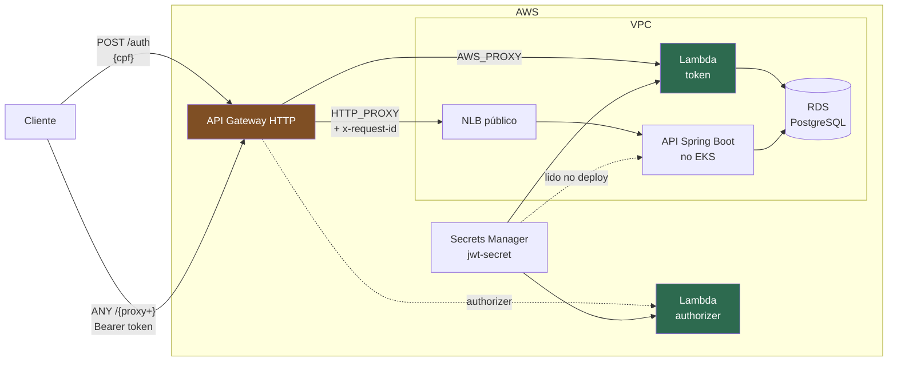

# oficina-lambda-auth — Function Serverless de autenticação + API Gateway

Camada de **entrada e autenticação** do Tech Challenge SOAT 13 — Fase 3.
Provisiona o **API Gateway HTTP** que é o endereço público do sistema e as duas
funções **AWS Lambda** que emitem e validam o token de acesso.

> ### Estado: completo
> Emissão de token, consulta do cliente e authorizer estão implementados, com
> **30 testes** cobrindo o fluxo inteiro. O authorizer está **ligado**
> (`enable_authorizer = true`): as rotas proxy exigem `Bearer` válido.
>
> Depende da migration `V19` no repositório `oficina-app`, que cria a coluna
> `clientes.ativo` — ver [Contrato com o banco](#contrato-com-o-banco-e-com-a-aplicação).

## Lugar na arquitetura



**Pré-requisito:** `oficina-infra-k8s` **e** `oficina-infra-database` aplicados
naquele ambiente — este repositório lê os dois states via `terraform_remote_state`.

## Rotas

| Rota | Integração | Autenticação |
|---|---|---|
| `POST /auth` | Lambda `token` | Pública — é onde o token é obtido |
| `ANY /{proxy+}` | NLB público da aplicação | Lambda Authorizer (quando `enable_authorizer = true`) |

A rota proxy só é criada depois que `app_base_url` do ambiente é preenchido — o
hostname do NLB só existe após o primeiro deploy da aplicação. Até lá o gateway
expõe apenas `/auth`, e o `apply` funciona normalmente.

### Contrato de `POST /auth`

```jsonc
// requisição
{ "cpf": "529.982.247-25" }

// 200
{
  "token": "eyJhbGciOiJIUzI1NiIs...",
  "expiraEm": 3600,
  "tipo": "Bearer",
  "cliente": { "id": "3f1c9a2e-...", "nome": "Fulano de Tal" }
}

// 400 CPF_INVALIDO · 404 CLIENTE_NAO_ENCONTRADO · 403 CLIENTE_INATIVO · 500 ERRO_INTERNO
{ "codigo": "CPF_INVALIDO", "mensagem": "CPF invalido." }
```

Toda resposta carrega o header `x-request-id`, o mesmo id que aparece no log
estruturado e no access log do gateway.

## Componentes

| Arquivo | O que faz | Testes |
|---|---|---|
| `src/lib/cpf.mjs` | Validação por dígito verificador, normalização e máscara para log | 6 |
| `src/lib/jwt.mjs` | Assina HS256 e verifica HS256/384/512 com `node:crypto`; comparação em tempo constante e recusa de `alg` inesperado | 8 |
| `src/lib/banco.mjs` | Pool do PostgreSQL no escopo do módulo e consulta do cliente por CPF | 7 |
| `src/lib/segredos.mjs` | Lê o Secrets Manager com cache no container | — |
| `src/lib/log.mjs` | Log JSON com `requestId` de correlação | — |
| `src/handlers/token.mjs` | Fluxo completo de `POST /auth` | 8 |
| `src/handlers/authorizer.mjs` | Valida o Bearer e devolve `isAuthorized` + contexto | — |
| `infra/` | Terraform: gateway, 2 Lambdas, IAM, security groups, segredo, log groups | — |

```bash
npm test     # 30 testes, sem framework externo (node:test)
```

## Contrato com o banco e com a aplicação

Três acoplamentos que quebram o login se mudarem sem coordenação:

**1 · A coluna `clientes.ativo`** — criada pela migration `V19` em `oficina-app`.
Sem ela a consulta falha com `column ativo does not exist`. Aplique a migration
**antes** de subir esta função.

**2 · A normalização do documento na leitura:**

```sql
WHERE regexp_replace(cpf_ou_cnpj, '\D', '', 'g') = $1
```

A coluna guarda o documento **como foi digitado** — o domínio valida por dígito
verificador mas persiste a string original, então o mesmo CPF pode estar gravado
como `529.982.247-25` ou `52998224725`. A `V19` cria um índice funcional sobre a
mesma expressão, então a comparação não cai em *sequential scan*.

**3 · A claim `tipo: "CLIENTE"`** — é por ela que o `JwtAuthenticationFilter` da
aplicação decide autenticar pelas próprias claims em vez de procurar o CPF na
tabela `usuarios`. Um cliente não é usuário do sistema e não deve precisar ser.

Sobre algoritmos: assinamos em **HS256** e verificamos **HS256, HS384 e HS512**.
A assimetria é proposital — a `jjwt` da aplicação escolhe o algoritmo pelo
*tamanho* da chave e, com o segredo de 64 caracteres gerado pelo Terraform,
assina em HS512. Um authorizer restrito a HS256 recusaria no gateway todo token
vindo do login de e-mail e senha.

## Tecnologias

Node.js 22 (ESM, zero dependência além do AWS SDK) · `node:test` · AWS Lambda ·
API Gateway HTTP (v2) · AWS Secrets Manager · CloudWatch Logs · Terraform ≥ 1.10
com workspaces · GitHub Actions.

## Como rodar e implantar

```bash
npm ci
npm test
npm run build          # monta build/ com src + node_modules de produção

cd infra
cp backend.hcl.example backend.hcl              # bucket do state
cp terraform.tfvars.example terraform.tfvars    # mesma bucket
terraform init -backend-config=backend.hcl
terraform workspace select -or-create hml       # ou prd
terraform apply
```

⚠️ **`npm run build` antes de qualquer `terraform plan/apply`.** O
`archive_file` empacota `build/`; sem ele o plan falha com *no such file or
directory*. A pipeline já faz isso.

Depois do primeiro deploy da aplicação, pegue o hostname do NLB e preencha
`app_base_url` para publicar a rota proxy:

```bash
kubectl -n oficina-hml get svc oficina-api \
  -o jsonpath='{.status.loadBalancer.ingress[0].hostname}'
```

## CI/CD

Workflow: [`.github/workflows/ci-cd.yml`](.github/workflows/ci-cd.yml)

| Gatilho | O que roda |
|---|---|
| Pull request | `npm test` → `fmt` → `validate` → `plan` dos dois workspaces, comentado no PR |
| Push em `desenvolvimento` | Testes + plan dos dois workspaces |
| **Push em `homologacao`** | Testes → build → **`apply` no workspace `hml`** → smoke test de `POST /auth` |
| **Push em `master`** | Testes → build → **`apply` no workspace `prd`** → smoke test |
| *Run workflow* manual | `plan`, `apply` ou `destroy` no ambiente escolhido |

Jobs, no padrão de nomes comum aos quatro repositórios do projeto:

| Job | O que faz |
|---|---|
| `testes` | `npm test` — 30 casos com `node:test`, sem framework externo |
| `validacao` | `terraform fmt -check` e `terraform validate` |
| `plan` | `terraform plan` do workspace, comentado no PR |
| `deploy` | `npm run build` → `terraform apply` no workspace do ambiente → smoke test |
| `destroy` | `terraform destroy` no workspace do ambiente |

O smoke test faz um `POST /auth` real depois do apply e falha o job se o gateway
não responder — pega rota mal configurada ou `lambda_permission` faltando, que
são os erros silenciosos mais comuns aqui.

### Workflow auxiliar — `Formatar Terraform`

[`terraform-fmt.yml`](.github/workflows/terraform-fmt.yml), manual (*Run
workflow*): roda `terraform fmt -recursive`, regrava o `infra/.terraform.lock.hcl`
com os hashes de Linux, macOS e Windows e commita o resultado **na branch em que
foi disparado** — escolha a sua branch de trabalho, não `master` nem
`homologacao` (protegidas, o push seria recusado).

Existe porque o gate `fmt -check` reprova qualquer desalinhamento e nem todo
mundo do time tem o Terraform instalado na máquina. Enquanto o lockfile não
estiver versionado, cada `terraform init` resolve as versões de provider do zero
dentro das restrições de `infra/versions.tf`; rode este workflow uma vez na sua
branch para fixá-las.

### Configuração exigida no repositório

| Tipo | Nome | Valor |
|---|---|---|
| Secret | `AWS_ACCESS_KEY_ID` | Credencial AWS da pipeline |
| Secret | `AWS_SECRET_ACCESS_KEY` | — |
| Variable | `TF_STATE_BUCKET` | **A mesma bucket** das outras camadas |
| Variable | `AWS_REGION` | Opcional, default `us-east-1` |

### Regras de proteção de branch

`master` e `homologacao` protegidas, merge só por Pull Request, fluxo
`feature/*` → `desenvolvimento` → `homologacao` → `master` imposto pelo job
`guard` ([`pr-source-guard.yml`](.github/workflows/pr-source-guard.yml)).

## Contrato do segredo JWT com o repositório da aplicação

O segredo HMAC é criado **aqui**, em `oficina/<ambiente>/jwt-secret` no Secrets
Manager, e lido pela pipeline de `oficina-app` para popular `JWT_SECRET` no
cluster. Este repositório é a **fonte da verdade** do segredo.

> Um `terraform destroy` aqui gera um segredo novo no próximo `apply`, o que
> invalida todos os tokens em circulação e exige um novo deploy da aplicação
> para ressincronizar.

## Custo estimado

Lambda e API Gateway são pagos por uso e ficam **dentro do *free tier*** no
volume de uma demonstração (1 M de requisições/mês grátis na Lambda; US$ 1,00 por
milhão no HTTP API). O custo relevante desta camada é praticamente zero — o que
pesa é a plataforma (EKS/NAT) e o banco.

## Limitações conhecidas (escopo de desafio técnico)

- **HS256 com segredo compartilhado.** RS256 + JWKS seria a evolução correta; a justificativa está no ADR.
- **O NLB da aplicação segue público**, então é possível contornar o gateway. Decisão consciente (a alternativa era VPC Link + NLB interno).
- **CORS liberado para `*`.** Adequado à demo; um front real fixaria a origem.

## Documentação

- [ADR 0001 — API Gateway HTTP, Lambda Authorizer e JWT HS256](docs/adr/0001-api-gateway-e-autorizacao.md)
- ADRs de infraestrutura: repositórios `oficina-infra-k8s` e `oficina-infra-database`
